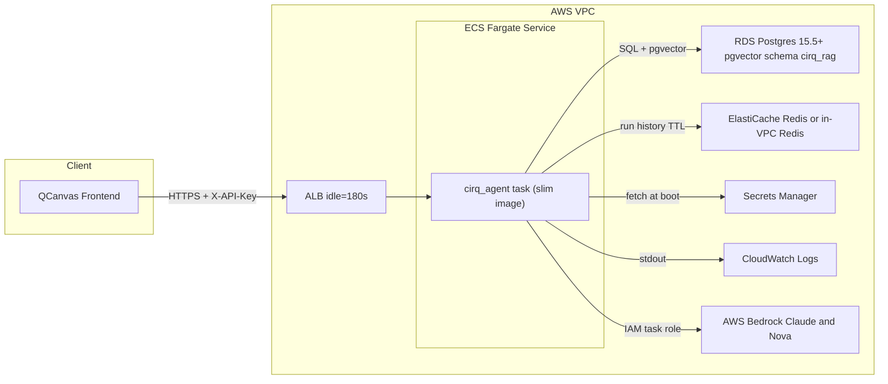

## Target architecture



## Phase 1 - pgvector backend for VectorStore

Goal: replace on-disk FAISS in production, keep FAISS for local dev.

- Add new backend branch `pgvector` in [Cirq-RAG-Code-Assistant/src/rag/vector_store.py](Cirq-RAG-Code-Assistant/src/rag/vector_store.py) parallel to `_init_faiss` and `_init_chroma`. Uses `psycopg[binary]` + `pgvector.psycopg.register_vector` (no SQLAlchemy needed here to keep the RAG service light).
- Store schema (one-time SQL migration shipped as `Cirq-RAG-Code-Assistant/scripts/sql/001_init_pgvector.sql`):
  ```sql
  CREATE EXTENSION IF NOT EXISTS vector;
  CREATE SCHEMA IF NOT EXISTS cirq_rag;
  CREATE TABLE cirq_rag.rag_knowledge_base (
      id BIGSERIAL PRIMARY KEY,
      source TEXT NOT NULL,
      doc_id TEXT NOT NULL UNIQUE,
      content TEXT NOT NULL,
      content_hash TEXT NOT NULL,
      metadata JSONB NOT NULL DEFAULT '{}'::jsonb,
      embedding vector(1024) NOT NULL,
      model_id TEXT NOT NULL,
      created_at TIMESTAMPTZ NOT NULL DEFAULT now(),
      updated_at TIMESTAMPTZ NOT NULL DEFAULT now()
  );
  CREATE INDEX rag_kb_embedding_hnsw ON cirq_rag.rag_knowledge_base
      USING hnsw (embedding vector_cosine_ops) WITH (m=16, ef_construction=64);
  CREATE INDEX rag_kb_source_idx ON cirq_rag.rag_knowledge_base (source);
  CREATE INDEX rag_kb_metadata_gin ON cirq_rag.rag_knowledge_base USING gin (metadata);
  ```
- Method mappings inside `VectorStore`:
  - `add` -> `INSERT ... ON CONFLICT (doc_id) DO UPDATE SET embedding=..., content_hash=..., updated_at=now()`
  - `search` -> `SELECT id, content, metadata, 1 - (embedding <=> $1) AS score FROM cirq_rag.rag_knowledge_base WHERE ($2::text IS NULL OR source=$2) ORDER BY embedding <=> $1 LIMIT $3`
  - `get_by_id` -> `SELECT ... WHERE doc_id=$1`
  - `size` -> `SELECT count(*)`
  - `save` / `load` become no-ops (DB is the store).
- Extend `config.json` under `rag.vector_store`:
  ```json
  "type": "pgvector",
  "pgvector": {
    "schema": "cirq_rag",
    "table": "rag_knowledge_base",
    "dsn_env": "CIRQ_RAG_DB_URL"
  }
  ```
- Local dev default stays `"type": "faiss"`; deployed override (env or `config.prod.json`) selects `"pgvector"`.
- Ingestion script `Cirq-RAG-Code-Assistant/scripts/ingest_kb_to_pgvector.py`:
  1. Reads `data/knowledge_base/curated_*_examples.jsonl`.
  2. Normalizes each entry to `(source, doc_id, content, metadata)`.
  3. Computes `content_hash = sha256(content)`.
  4. Skips rows where `doc_id + content_hash + model_id` already match the DB (dedupe, no re-embed).
  5. For new/changed rows, calls `EmbeddingModel.encode` (respects Bedrock throttle via the existing `request_delay_seconds`).
  6. Idempotent; safe to re-run.
- Unit-ish test: `Cirq-RAG-Code-Assistant/tests/unit/test_vector_store_pgvector.py` that uses monkeypatched psycopg connection, plus an opt-in integration test gated on `CIRQ_RAG_DB_URL`.

## Phase 2 - Dockerfile and dependency slimming

- Split [Cirq-RAG-Code-Assistant/requirements.txt](Cirq-RAG-Code-Assistant/requirements.txt) into three files:
  - `requirements-base.txt` (runtime, prod): `fastapi`, `uvicorn[standard]`, `pydantic`, `pydantic-settings`, `boto3`, `botocore`, `httpx`, `cirq-core` (not full `cirq`), `numpy`, `scipy`, `psycopg[binary]`, `pgvector`, `redis`, `python-dotenv`, `loguru`, `pyyaml`, `tenacity`.
  - `requirements-local.txt` (adds to base, for devs who run FAISS locally): `faiss-cpu`, `sentence-transformers`, `torch`, `transformers`.
  - `requirements-dev.txt` (adds to local): `pytest`, `pytest-asyncio`, `pytest-cov`, `black`, `isort`, `mypy`, `flake8`, `jupyter`, notebook tools, `qiskit`, `pennylane`, `qutip`, `chromadb`, `langchain*`, `openai`.
- Rewrite [Cirq-RAG-Code-Assistant/Dockerfile](Cirq-RAG-Code-Assistant/Dockerfile) as a multi-stage build that installs only `requirements-base.txt`, runs as a non-root user, sets `PYTHONDONTWRITEBYTECODE=1`, copies only needed paths (exclude `notebooks/`, `docs/`, `sample dataset/`, `.cache/`, `data/models/vector_index/`).
- Add a separate `Dockerfile.dev` that installs local + dev requirements (used by docker-compose local).
- Guard torch/sentence-transformers imports in `src/rag/embeddings.py` so the slim image truly doesn't need them (the `provider == "aws"` path must never transitively import torch). Verify by `python -c "from src.rag.embeddings import EmbeddingModel"` in a torch-less venv.

## Phase 3 - Production hardening in src/server.py

Changes in [Cirq-RAG-Code-Assistant/src/server.py](Cirq-RAG-Code-Assistant/src/server.py):

- CORS: add `CORSMiddleware` with `allow_origins` read from env var `CIRQ_RAG_ALLOWED_ORIGINS` (comma-separated), defaulting to `*` only in dev.
- API-key auth: FastAPI dependency reading `X-API-Key`, comparing to value loaded from Secrets Manager at startup (env `CIRQ_RAG_API_KEY`). Apply to `/api/v1/*` routes. Skip for `/health`, `/readiness`, `/docs` (guard `/docs` with same key in prod via env flag `CIRQ_RAG_DISABLE_DOCS=true`).
- Health endpoints:
  - `GET /health` -> `{"status":"ok"}` (liveness).
  - `GET /readiness` -> checks Bedrock client init + Postgres `SELECT 1` (readiness); used by ALB target group.
- Replace `_RUN_HISTORY` dict with `RunHistoryStore` interface, two impls:
  - `InMemoryRunHistory` (default for tests/dev).
  - `RedisRunHistory` using `redis.Redis.from_url(os.environ["CIRQ_RAG_REDIS_URL"])`, 24h TTL per run, sorted-set index for `list_runs`.
- Error envelope: wrap Bedrock `ThrottlingException` and timeout errors into HTTP 503 with `Retry-After` header; return a consistent error shape `{error: {code, message, retryable}}`.
- Add startup banner that logs: provider, vector-store backend, DB host (no password), Redis host, Bedrock region.

## Phase 4 - Config, logging, and env bootstrap

- Extend [Cirq-RAG-Code-Assistant/config/config_loader.py](Cirq-RAG-Code-Assistant/config/config_loader.py) so any `config.json` value can be overridden by an env var (env wins). Document the mapping (e.g. `CIRQ_RAG_VECTOR_STORE_TYPE` -> `rag.vector_store.type`).
- Logging:
  - Production flag `CIRQ_RAG_LOG_MODE=stdout` disables file logging in `src/cirq_rag_code_assistant/config/logging.py`.
  - Default log format in prod: JSON lines (loguru JSON serializer) so CloudWatch Insights can parse.
- Startup validation: fail fast with a clear message if any of these are missing in prod: `CIRQ_RAG_DB_URL`, `CIRQ_RAG_REDIS_URL`, `CIRQ_RAG_API_KEY`, `AWS_DEFAULT_REGION`, `BEDROCK_INFERENCE_PROFILE_ARN_*`.

## Phase 5 - Compose split and ECS task definition

- Split the root [docker-compose.yml](docker-compose.yml):
  - `docker-compose.yml` stays dev-focused. Keep the bind mount and `--reload` only here.
  - New `docker-compose.prod.yml` for local prod-parity: builds the slim image, no bind mount, no `--reload`, reads secrets from env, points `CIRQ_RAG_VECTOR_STORE_TYPE=pgvector`, adds Redis URL, adds API key.
- Provide an ECS task definition template at `Cirq-RAG-Code-Assistant/deploy/ecs/cirq-agent.taskdef.json`:
  - `cpu=2048`, `memory=4096` (tune later).
  - Task IAM role with policy allowing `bedrock:InvokeModel`, `bedrock:InvokeModelWithResponseStream`, `secretsmanager:GetSecretValue` for the specific secret ARNs.
  - Execution role for ECR pull + CloudWatch logs.
  - `logConfiguration` = `awslogs` driver to log group `/ecs/cirq-agent`.
  - `secrets` array injecting `CIRQ_RAG_DB_URL`, `CIRQ_RAG_REDIS_URL`, `CIRQ_RAG_API_KEY` from Secrets Manager.
  - `healthCheck` hitting `curl -f http://localhost:8000/health`.
  - `startPeriod=180` for cold-start buffer.
- Provide a `deploy/ecs/README.md` with copy-paste AWS CLI commands for: ECR push, register task def, create service, ALB target group with idle timeout 180s, and a note to NOT put API Gateway in front (29s hard limit vs 15-60s pipeline).

## Phase 6 - README and docs cleanup

- In [Cirq-RAG-Code-Assistant/README.md](Cirq-RAG-Code-Assistant/README.md): tag the Ollama section clearly as "Local development only (not used when `models.embedding.provider=aws` / Bedrock agents)". Config already wires agents to Bedrock.
- Update [Cirq-RAG-Code-Assistant/QCANVAS_INTEGRATION_GUIDE.md](Cirq-RAG-Code-Assistant/QCANVAS_INTEGRATION_GUIDE.md): note the API now requires `X-API-Key`, add prod base URL guidance, document 180s ALB timeout.
- Add `Cirq-RAG-Code-Assistant/docs/deployment-aws.md`: step-by-step (build image, push to ECR, provision RDS + pgvector, run ingestion script from a one-shot Fargate task, deploy service, smoke test).

## Phase 7 - Tests and smoke checks

- Unit tests:
  - `tests/unit/test_vector_store_pgvector.py` (mocked psycopg).
  - `tests/unit/test_run_history_redis.py` (fakeredis).
  - `tests/unit/test_auth_api_key.py` (FastAPI TestClient).
- Integration (opt-in, skipped unless env set):
  - `tests/integration/test_pgvector_roundtrip.py` (real Postgres via `CIRQ_RAG_DB_URL`).
- Smoke script `Cirq-RAG-Code-Assistant/scripts/smoke_prod.py` that hits `/health`, `/readiness`, and a minimal `POST /api/v1/generate` with `enable_optimizer=false, enable_educational=false` to keep it under 30s.

## Out of scope (flagging now, can be added later)

- Terraform / CDK / CloudFormation IaC - plan ships a task def JSON + CLI commands only.
- Autoscaling policies (can be added once baseline load is measured).
- WAF rules in front of the ALB.
- Migrating `qcanvas_backend` or `frontend` - this plan only touches `Cirq-RAG-Code-Assistant` and its slice of `docker-compose.yml`.
- Multi-region failover.

## Risks and mitigations

- Bedrock model access not granted in region - mitigated by `/readiness` calling a cheap Bedrock list call at boot and failing loudly.
- pgvector not available on the Postgres version - verify `SELECT extversion FROM pg_extension WHERE extname='vector';` before migration; RDS needs 15.5+/16.x.
- Re-embedding cost on first ingest - ingestion script is idempotent and resumable; run once from a one-shot Fargate task.
- Slim image missing a transitive dep - covered by CI check that imports the FastAPI app in the base-requirements venv.