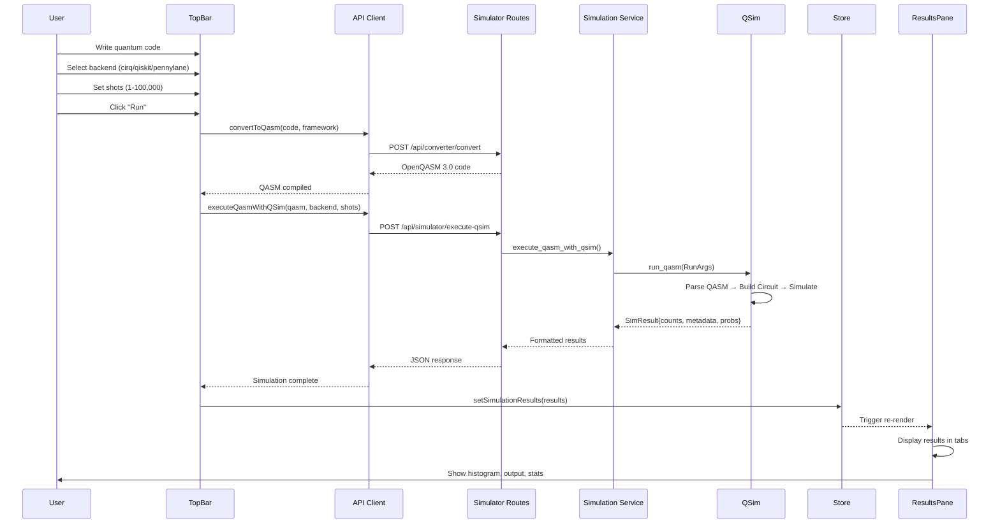

# QSim Integration Guide

> **Last Updated**: November 2025  
> **Status**: Production Ready  
> **Version**: 1.0

## Table of Contents

- [Overview](#overview)
- [Architecture](#architecture)
- [Integration Flow](#integration-flow)
- [Frontend Changes](#frontend-changes)
  - [TopBar Component](#topbar-component)
  - [Store State Management](#store-state-management)
  - [ResultsPane Component](#resultspane-component)
  - [API Client](#api-client)
- [Backend Changes](#backend-changes)
  - [Simulation Service](#simulation-service)
  - [Simulator API Routes](#simulator-api-routes)
- [Data Structures](#data-structures)
- [User Workflow](#user-workflow)
- [Testing](#testing)
- [Troubleshooting](#troubleshooting)

---

## Overview

QCanvas has been integrated with **QSim**, a Python backend framework for simulating OpenQASM 3.0 code on multiple quantum simulation backends (Cirq, Qiskit, PennyLane). This integration creates a unified workflow where:

1. **QCanvas** handles compilation from quantum frameworks to OpenQASM 3.0
2. **QSim** executes the OpenQASM code on user-selected backends
3. **Results** are displayed in the frontend with comprehensive statistics

### Key Benefits

- ✅ **Unified Interface**: Single platform for writing, compiling, and simulating quantum circuits
- ✅ **Multi-Backend Support**: Choose between Cirq, Qiskit, or PennyLane execution backends
- ✅ **Real-Time Results**: Immediate feedback with measurement counts and state probabilities
- ✅ **Detailed Statistics**: Comprehensive execution metrics and circuit analysis
- ✅ **Framework Agnostic**: Write code in any supported framework, execute on any backend

---

## Architecture

### System Overview

```
┌─────────────────────────────────────────────────────────────────┐
│                         Frontend (Next.js)                       │
│                                                                   │
│  ┌──────────────┐    ┌──────────────┐    ┌──────────────┐     │
│  │   TopBar     │───▶│    Store     │◀───│ ResultsPane  │     │
│  │ (Controls)   │    │   (State)    │    │  (Display)   │     │
│  └──────────────┘    └──────────────┘    └──────────────┘     │
│         │                    │                    ▲              │
└─────────┼────────────────────┼────────────────────┼──────────────┘
          │                    │                    │
          ▼                    ▼                    │
┌─────────────────────────────────────────────────────────────────┐
│                      Backend (FastAPI)                           │
│                                                                   │
│  ┌──────────────────┐         ┌──────────────────┐             │
│  │ Converter Routes │         │ Simulator Routes  │             │
│  │ (Compile QASM)   │         │ (Execute QSim)    │             │
│  └────────┬─────────┘         └────────┬──────────┘             │
│           │                            │                         │
│           ▼                            ▼                         │
│  ┌──────────────────┐         ┌──────────────────┐             │
│  │ Conversion       │         │ Simulation       │             │
│  │ Service          │         │ Service          │             │
│  └──────────────────┘         └────────┬──────────┘             │
│                                         │                         │
└─────────────────────────────────────────┼─────────────────────────┘
                                          │
                                          ▼
                              ┌────────────────────┐
                              │       QSim         │
                              │  (Quantum Sim)     │
                              │                    │
                              │  ┌──────────────┐ │
                              │  │ Cirq Backend │ │
                              │  ├──────────────┤ │
                              │  │Qiskit Backend│ │
                              │  ├──────────────┤ │
                              │  │PennyL Backend│ │
                              │  └──────────────┘ │
                              └────────────────────┘
```

### Component Responsibilities

| Component | Responsibility |
|-----------|---------------|
| **TopBar** | User controls for backend selection, shots configuration, and execution trigger |
| **Store** | Central state management for simulation results and conversion statistics |
| **ResultsPane** | Display simulation results in multiple formats (output, histogram, stats) |
| **API Client** | HTTP communication layer between frontend and backend |
| **Simulator Routes** | FastAPI endpoints for QSim execution |
| **Simulation Service** | Business logic layer that interfaces with QSim |
| **QSim** | Core simulation engine with multi-backend support |

---

## Integration Flow

### Complete Workflow



### Step-by-Step Process

1. **User Input**
   - User writes quantum circuit code (Qiskit/Cirq/PennyLane)
   - Selects simulation backend from dropdown
   - Configures number of shots (1-100,000)

2. **Compilation Phase** (QCanvas)
   - Code is sent to `/api/converter/convert`
   - QCanvas converts framework code to OpenQASM 3.0
   - Conversion statistics are stored (gates, depth, qubits)

3. **Execution Phase** (QSim)
   - OpenQASM code sent to `/api/simulator/execute-qsim`
   - QSim parses QASM and builds circuit using selected backend
   - Simulation runs with specified shots
   - Results returned as `SimResult` object

4. **Display Phase**
   - Results stored in global state via Zustand
   - ResultsPane automatically updates
   - Multiple visualization options available (histogram, output, stats)

---

## Frontend Changes

### TopBar Component

**File**: `frontend/components/TopBar.tsx`

#### New State Variables

```typescript
// QSim execution parameters
const [shots, setShots] = useState(1024);
const [simBackend, setSimBackend] = useState<'cirq' | 'qiskit' | 'pennylane'>('cirq');
```

#### New UI Controls

**Backend Selector**:
```tsx
<select
  value={simBackend}
  onChange={(e) => setSimBackend(e.target.value as 'cirq' | 'qiskit' | 'pennylane')}
  className="hidden lg:block bg-editor-bg border border-editor-border ..."
  title="Simulation Backend"
>
  <option value="cirq">Cirq</option>
  <option value="qiskit">Qiskit</option>
  <option value="pennylane">PennyLane</option>
</select>
```

**Shots Input**:
```tsx
<input
  type="number"
  value={shots}
  onChange={(e) => setShots(Math.max(1, Number.parseInt(e.target.value) || 1024))}
  min="1"
  max="100000"
  className="hidden lg:block bg-editor-bg border border-editor-border ... w-24"
  title="Number of shots"
  placeholder="Shots"
/>
```

#### Updated Run Handler

The `handleRun` function was completely refactored:

**Key Changes**:
1. **Framework Detection**: Auto-detects whether code is QASM or framework-specific
2. **Compilation**: Converts framework code to OpenQASM if needed
3. **QSim Execution**: Calls new `executeQasmWithQSim` API with user-selected backend and shots
4. **State Management**: Stores results in global state for display

```typescript
const handleRun = async () => {
  // 1. Detect if QASM or framework code
  const isQasmFile = activeFile.name.endsWith(".qasm") || 
                     activeFile.content.trim().startsWith("OPENQASM");

  let qasmCode = "";
  
  if (isQasmFile) {
    qasmCode = activeFile.content;
  } else {
    // Auto-detect framework and convert
    let sourceFramework: string;
    if (activeFile.content.includes("import cirq")) {
      sourceFramework = "cirq";
    } else if (activeFile.content.includes("import pennylane")) {
      sourceFramework = "pennylane";
    } else {
      sourceFramework = "qiskit";
    }
    
    // Convert to QASM
    const conversionResult = await quantumApi.convertToQasm(
      activeFile.content,
      sourceFramework,
      "classic"
    );
    
    qasmCode = conversionResult.data.qasm_code;
  }

  // 2. Execute with QSim
  const executionResult = await quantumApi.executeQasmWithQSim(
    qasmCode,
    simBackend,  // User-selected backend
    shots        // User-configured shots
  );

  // 3. Store results
  if (executionResult.success) {
    useFileStore.getState().setSimulationResults(
      executionResult.data.results
    );
  }
};
```

---

### Store State Management

**File**: `frontend/lib/store.ts`

#### New Interfaces

**SimulationResult Interface**:
```typescript
interface SimulationResult {
  counts: { [state: string]: number }
  metadata: {
    n_qubits: number
    visitor: string
    backend: string
    shots: number
    [key: string]: any  // Allow custom metadata fields
  }
  probs?: { [state: string]: number } | null
  circuit?: any
}
```

#### Store Extension

```typescript
interface FileStore extends EditorState {
  // Existing state
  conversionStats: ConversionStats | null
  
  // NEW: Simulation results state
  simulationResults: SimulationResult | null
  
  // Actions
  setConversionStats: (stats: ConversionStats | null) => void
  
  // NEW: Set simulation results
  setSimulationResults: (results: SimulationResult | null) => void
}
```

#### Implementation

```typescript
export const useFileStore = create<FileStore>()(
  devtools((set, get) => ({
    // Initial state
    simulationResults: null,
    
    // Action implementation
    setSimulationResults: (results) => {
      set({ simulationResults: results }, false, 'setSimulationResults')
    },
  }))
);
```

**Why This Matters**:
- Centralized state management ensures all components have access to simulation results
- Type-safe interface prevents runtime errors
- DevTools integration for debugging
- Automatic re-renders when results change

---

### ResultsPane Component

**File**: `frontend/components/ResultsPane.tsx`

The ResultsPane received the most significant updates to display QSim simulation results.

#### State Access

```typescript
const { 
  resultsCollapsed, 
  toggleResults, 
  compiledQasm, 
  getActiveFile, 
  conversionStats, 
  simulationResults  // NEW: Access simulation results
} = useFileStore()
```

#### Display Stats Integration

**Dynamic Stats Computation**:
```typescript
const getDisplayStats = () => {
  // Use simulation results if available
  const executionData = simulationResults ? {
    status: 'completed',
    totalTime: simulationResults.metadata.execution_time || 'N/A',
    simulationTime: simulationResults.metadata.simulation_time || 'N/A',
    postProcessingTime: simulationResults.metadata.postprocessing_time || 'N/A',
    shots: simulationResults.metadata.shots || 0,
    successfulShots: Object.values(simulationResults.counts)
                            .reduce((a, b) => a + b, 0),
    backend: simulationResults.metadata.backend || 'N/A',
    visitor: simulationResults.metadata.visitor || 'N/A',
    memoryUsage: simulationResults.metadata.memory_usage || '-',
    cpuUsage: simulationResults.metadata.cpu_usage || '-',
    fidelity: simulationResults.metadata.fidelity || 100.0
  } : {
    // Default pending state
    status: 'pending',
    // ... defaults
  };
  
  return {
    compilation: { /* ... */ },
    circuit: { /* ... */ },
    execution: executionData,
    optimization: { /* ... */ }
  };
};
```

#### Output Tab Enhancement

Shows complete QSim results with three sections:

**1. Measurement Counts**:
```tsx
<div>
  <h5 className="text-xs font-medium text-gray-400 mb-2">Measurement Counts</h5>
  <pre className="text-sm text-editor-text">
    {JSON.stringify(simulationResults.counts, null, 2)}
  </pre>
</div>
```

**2. State Probabilities** (if available):
```tsx
{simulationResults.probs && (
  <div className="mt-3 pt-3 border-t border-editor-border">
    <h5 className="text-xs font-medium text-gray-400 mb-2">State Probabilities</h5>
    <pre className="text-sm text-editor-text">
      {JSON.stringify(simulationResults.probs, null, 2)}
    </pre>
  </div>
)}
```

**3. Simulation Metadata**:
```tsx
<div className="mt-3 pt-3 border-t border-editor-border">
  <h5 className="text-xs font-medium text-gray-400 mb-2">Simulation Metadata</h5>
  <pre className="text-sm text-editor-text">
    {JSON.stringify(simulationResults.metadata, null, 2)}
  </pre>
</div>
```

#### Histogram Tab Enhancement

**Updated Results Display**:
```tsx
const quantumResults = simulationResults ? {
  counts: simulationResults.counts,
  shots: simulationResults.metadata.shots || 1024,
  backend: simulationResults.metadata.backend || 'N/A',
  execution_time: 'N/A',
  circuit_info: {
    depth: conversionStats?.depth || 0,
    qubits: simulationResults.metadata.n_qubits || 0,
    gates: conversionStats?.gates ? 
           Object.values(conversionStats.gates).reduce((a, b) => a + b, 0) : 0
  },
  metadata: simulationResults.metadata,
  probs: simulationResults.probs
} : {
  // Default mock data
};
```

**Footer Information**:
```tsx
<div className="grid grid-cols-2 md:grid-cols-4 gap-4 text-sm">
  <div>
    <span className="text-gray-400">Total Shots:</span>
    <span className="text-white ml-2 font-mono">{quantumResults.shots}</span>
  </div>
  <div>
    <span className="text-gray-400">Backend:</span>
    <span className="text-white ml-2 font-mono">{quantumResults.backend}</span>
  </div>
  {simulationResults?.metadata.visitor && (
    <div>
      <span className="text-gray-400">Visitor:</span>
      <span className="text-white ml-2 font-mono">
        {simulationResults.metadata.visitor}
      </span>
    </div>
  )}
  <div>
    <span className="text-gray-400">States:</span>
    <span className="text-white ml-2 font-mono">
      {Object.keys(quantumResults.counts).length}
    </span>
  </div>
</div>
```

**Probability Display**:
```tsx
{simulationResults?.probs && (
  <div className="mt-4 pt-4 border-t border-editor-border">
    <h5 className="text-xs font-medium text-gray-400 mb-2">
      State Probabilities
    </h5>
    <div className="grid grid-cols-2 md:grid-cols-4 gap-2 text-xs">
      {Object.entries(simulationResults.probs).map(([state, prob]) => (
        <div key={state} className="bg-editor-bg border border-editor-border rounded px-2 py-1">
          <span className="text-gray-400">|{state}⟩:</span>
          <span className="text-white ml-1 font-mono">
            {(prob * 100).toFixed(2)}%
          </span>
        </div>
      ))}
    </div>
  </div>
)}
```

#### Stats Tab Enhancement

**NEW Section: QSim Simulation Details**

Only appears when simulation results are available:

```tsx
{simulationResults && (
  <div className="bg-editor-bg border border-editor-border rounded-lg p-4">
    <h4 className="text-sm font-medium text-white mb-4 flex items-center">
      <Zap className="w-4 h-4 mr-2" />
      QSim Simulation Details
    </h4>
    <div className="grid md:grid-cols-2 gap-6">
      {/* Measurement Results */}
      <div>
        <h5 className="text-xs font-medium text-gray-400 mb-3">
          Measurement Results
        </h5>
        <div className="space-y-2">
          <div className="flex justify-between items-center">
            <span className="text-sm text-editor-text">Total States Measured:</span>
            <span className="text-sm text-white">
              {Object.keys(simulationResults.counts).length}
            </span>
          </div>
          <div className="flex justify-between items-center">
            <span className="text-sm text-editor-text">Total Counts:</span>
            <span className="text-sm text-white">
              {Object.values(simulationResults.counts).reduce((a, b) => a + b, 0)}
            </span>
          </div>
          {simulationResults.probs && (
            <div className="flex justify-between items-center">
              <span className="text-sm text-editor-text">Has Probabilities:</span>
              <span className="text-sm text-green-400">Yes</span>
            </div>
          )}
        </div>
      </div>
      
      {/* Execution Metadata */}
      <div>
        <h5 className="text-xs font-medium text-gray-400 mb-3">
          Execution Metadata
        </h5>
        <div className="space-y-2">
          {Object.entries(simulationResults.metadata).map(([key, value]) => {
            // Skip already displayed fields
            if (['n_qubits', 'backend', 'shots', 'visitor'].includes(key)) 
              return null;
            
            return (
              <div key={key} className="flex justify-between items-center">
                <span className="text-sm text-editor-text capitalize">
                  {key.replace(/_/g, ' ')}:
                </span>
                <span className="text-sm text-white font-mono text-right truncate max-w-[200px]" 
                      title={String(value)}>
                  {typeof value === 'object' 
                    ? JSON.stringify(value) 
                    : String(value)}
                </span>
              </div>
            );
          })}
        </div>
      </div>
    </div>
  </div>
)}
```

**Enhanced Execution Summary**:
- Color-coded status badges (green for completed, yellow for pending, red for failed)
- Real-time display of execution metrics
- Fidelity shown with 2 decimal precision

**Performance Metrics**:
- Shows visitor type (which QSim visitor was used)
- Displays timing information if provided by QSim
- Memory and CPU usage when available

---

### API Client

**File**: `frontend/lib/api.ts`

#### New API Function

```typescript
export const quantumApi = {
  // ... existing functions
  
  /**
   * Execute OpenQASM code with QSim backend
   * @param qasm_code - OpenQASM 3.0 code string
   * @param backend - QSim backend (cirq, qiskit, or pennylane)
   * @param shots - Number of measurement shots (1-100,000)
   * @returns Promise with simulation results
   */
  async executeQasmWithQSim(
    qasm_code: string, 
    backend: 'cirq' | 'qiskit' | 'pennylane' = 'cirq', 
    shots = 1024
  ): Promise<ApiResponse<any>> {
    return apiRequest('/api/simulator/execute-qsim', {
      method: 'POST',
      body: JSON.stringify({
        qasm_input: qasm_code,
        backend,
        shots,
      }),
    })
  },
}
```

**Request Format**:
```json
{
  "qasm_input": "OPENQASM 3.0;\ninclude \"stdgates.inc\";\n...",
  "backend": "cirq",
  "shots": 1024
}
```

**Response Format**:
```json
{
  "success": true,
  "results": {
    "counts": {
      "00": 512,
      "11": 512
    },
    "metadata": {
      "n_qubits": 2,
      "backend": "cirq",
      "visitor": "cirq_visitor",
      "shots": 1024
    },
    "probs": {
      "00": 0.5,
      "11": 0.5
    }
  },
  "backend": "cirq",
  "shots": 1024
}
```

---

## Backend Changes

### Simulation Service

**File**: `backend/app/services/simulation_service.py`

#### QSim Import

```python
# Import QSim for quantum simulation
try:
    from qsim import run_qasm, RunArgs, SimResult
    print("✓ QSim imported successfully")
    QSIM_AVAILABLE = True
except ImportError as e:
    print(f"Import error in simulation service: {e}")
    print("QSim simulation features may not be fully available")
    run_qasm = None
    RunArgs = None
    SimResult = None
    QSIM_AVAILABLE = False
```

#### New Service Method

```python
def execute_qasm_with_qsim(
    self, 
    qasm_code: str, 
    backend: str = "cirq", 
    shots: int = 1024
) -> Dict[str, Any]:
    """
    Execute OpenQASM code using QSim
    
    Args:
        qasm_code: OpenQASM 3.0 code to execute
        backend: QSim backend to use (cirq, qiskit, or pennylane)
        shots: Number of measurement shots
        
    Returns:
        Dictionary containing simulation results from QSim
    """
    try:
        if not QSIM_AVAILABLE:
            return {
                "success": False,
                "error": "QSim is not available. Please ensure it is installed correctly."
            }
        
        # Validate backend
        if backend not in self.available_backends:
            return {
                "success": False,
                "error": f"Unsupported QSim backend: {backend}. Available: {self.available_backends}"
            }
        
        # Create RunArgs for QSim
        args = RunArgs(
            qasm_input=qasm_code,
            backend=backend,
            shots=shots
        )
        
        # Execute with QSim
        sim_result: SimResult = run_qasm(args)
        
        # Convert SimResult to dictionary format
        result_dict = {
            "counts": sim_result.counts,
            "metadata": sim_result.metadata,
            "probs": sim_result.probs,
            # Circuit object omitted as it's not JSON serializable
        }
        
        return {
            "success": True,
            "results": result_dict,
            "backend": backend,
            "shots": shots
        }
        
    except Exception as e:
        return {
            "success": False,
            "error": f"QSim simulation failed: {str(e)}"
        }
```

**Key Implementation Details**:
1. **Availability Check**: Verifies QSim is properly installed
2. **Backend Validation**: Ensures requested backend is supported
3. **RunArgs Creation**: Converts request parameters to QSim's expected format
4. **Error Handling**: Graceful degradation with informative error messages
5. **Result Formatting**: Converts QSim's `SimResult` object to JSON-serializable dictionary

#### Updated Available Backends

```python
def __init__(self):
    self.available_backends = ['cirq', 'qiskit', 'pennylane']
    self.legacy_backends = ["statevector", "density_matrix"]

def get_available_backends(self) -> List[str]:
    """Get list of available simulation backends (QSim backends)"""
    return self.available_backends

def health_check(self) -> Dict[str, Any]:
    """Check health of simulation service"""
    try:
        backends = self.get_available_backends()
        return {
            "status": "healthy",
            "available_backends": backends,
            "qsim_available": QSIM_AVAILABLE
        }
    except Exception as e:
        return {
            "status": "unhealthy",
            "error": str(e)
        }
```

---

### Simulator API Routes

**File**: `backend/app/api/routes/simulator.py`

#### New Endpoint

```python
@router.post("/execute-qsim")
async def execute_qasm_with_qsim(request: dict):
    """
    Execute OpenQASM code using QSim backend
    
    Args:
        request: Dictionary containing qasm_input, backend (cirq/qiskit/pennylane), shots
        
    Returns:
        JSON response with QSim simulation results
    """
    try:
        qasm_input = request.get("qasm_input")
        backend = request.get("backend", "cirq")
        shots = request.get("shots", 1024)
        
        if not qasm_input:
            raise HTTPException(status_code=400, detail="qasm_input is required")
        
        # Execute with QSim
        result = simulation_service.execute_qasm_with_qsim(
            qasm_code=qasm_input,
            backend=backend,
            shots=shots
        )
        
        return JSONResponse(content=result)
        
    except HTTPException:
        raise
    except Exception as e:
        raise HTTPException(
            status_code=500, 
            detail=f"QSim simulation failed: {str(e)}"
        )
```

**Endpoint Details**:
- **URL**: `POST /api/simulator/execute-qsim`
- **Content-Type**: `application/json`
- **Authentication**: Not required (can be added later)
- **Rate Limiting**: Not implemented (should be added for production)

**Request Body Schema**:
```json
{
  "qasm_input": "string (required) - OpenQASM 3.0 code",
  "backend": "string (optional) - 'cirq' | 'qiskit' | 'pennylane', default: 'cirq'",
  "shots": "integer (optional) - 1 to 100000, default: 1024"
}
```

**Response Schema** (Success):
```json
{
  "success": true,
  "results": {
    "counts": {
      "state": "count"
    },
    "metadata": {
      "n_qubits": "integer",
      "backend": "string",
      "visitor": "string",
      "shots": "integer"
    },
    "probs": {
      "state": "float"
    }
  },
  "backend": "string",
  "shots": "integer"
}
```

**Response Schema** (Error):
```json
{
  "success": false,
  "error": "string - error message"
}
```

---

## Data Structures

### QSim RunArgs

**Purpose**: Input arguments for QSim's `run_qasm` function

```python
@dataclass
class RunArgs:
    """Arguments for run_qasm orchestration."""
    qasm_input: str | Path  # QASM3 code or .qasm file path
    backend: str = 'cirq'   # 'cirq', 'qiskit', or 'pennylane'
    shots: int = 1024       # 0 for exact statevector/probs
```

**Usage**:
```python
args = RunArgs(
    qasm_input="OPENQASM 3.0;...",
    backend="cirq",
    shots=1024
)
result = run_qasm(args)
```

### QSim SimResult

**Purpose**: Output structure from QSim simulation

```python
@dataclass
class SimResult:
    """Simulation output."""
    counts: Dict[str, int]        # {'00': 512, '11': 512}
    metadata: Dict[str, Any]      # {'n_qubits': 2, 'visitor': 'cirq'}
    probs: Optional[Dict[str, float]] = None  # {'00': 0.5, '11': 0.5}
    circuit: Any = None          # Framework circuit object
```

**Example**:
```python
SimResult(
    counts={'00': 512, '11': 512},
    metadata={
        'n_qubits': 2,
        'visitor': 'cirq_visitor',
        'backend': 'cirq',
        'shots': 1024
    },
    probs={'00': 0.5, '11': 0.5},
    circuit=<cirq.Circuit object>
)
```

### Frontend SimulationResult

**Purpose**: Type-safe interface for frontend state management

```typescript
interface SimulationResult {
  counts: { [state: string]: number }
  metadata: {
    n_qubits: number
    visitor: string
    backend: string
    shots: number
    [key: string]: any  // Extensible for custom fields
  }
  probs?: { [state: string]: number } | null
  circuit?: any
}
```

**Example**:
```typescript
const result: SimulationResult = {
  counts: { '00': 512, '11': 512 },
  metadata: {
    n_qubits: 2,
    visitor: 'cirq_visitor',
    backend: 'cirq',
    shots: 1024,
    execution_time: '0.25s',
    memory_usage: '128MB'
  },
  probs: { '00': 0.5, '11': 0.5 }
}
```

---

## User Workflow

### Step-by-Step Guide

#### 1. Write Quantum Code

Create a new file or use an existing one with quantum circuit code:

```python
# Example: PennyLane Bell State
import pennylane as qml
import numpy as np

dev = qml.device('default.qubit', wires=2)

@qml.qnode(dev)
def bell_circuit():
    qml.Hadamard(wires=0)
    qml.CNOT(wires=[0, 1])
    return qml.probs(wires=[0, 1])
```

#### 2. Configure Simulation Settings

In the TopBar:
- **Input Language**: Select the framework (PennyLane in this case)
- **Simulation Backend**: Choose execution backend (Cirq, Qiskit, or PennyLane)
- **Shots**: Set number of measurements (e.g., 1024)

#### 3. Compile to OpenQASM (Optional)

Click **"Compile to QASM"** to see the intermediate OpenQASM representation:

```qasm
OPENQASM 3.0;
include "stdgates.inc";

qubit[2] q;
bit[2] c;

h q[0];
cx q[0], q[1];
c[0] = measure q[0];
c[1] = measure q[1];
```

This step is optional - the "Run" button will automatically compile if needed.

#### 4. Run Simulation

Click **"Run"** button. The system will:
1. Compile code to OpenQASM (if not already compiled)
2. Send to QSim with selected backend
3. Execute simulation with specified shots
4. Display results in ResultsPane

#### 5. View Results

**Histogram Tab**:
- Visual bar chart of measurement outcomes
- Shows counts for each quantum state
- Displays state probabilities if available

**Output Tab**:
- Complete JSON output
- Measurement counts
- State probabilities (if shots=0 or special mode)
- Simulation metadata

**Stats Tab**:
- Execution summary (status, time, fidelity)
- Performance metrics (shots, backend, visitor)
- Circuit analysis (depth, width, gate distribution)
- QSim-specific details

**Console Tab**:
- Real-time log messages
- Execution progress
- Error messages if any

---

## Testing

### Manual Testing Checklist

#### Frontend Testing

- [ ] **TopBar Controls**
  - [ ] Backend selector displays all three options
  - [ ] Shots input accepts values 1-100,000
  - [ ] Input validation prevents invalid values
  - [ ] Controls are responsive on different screen sizes

- [ ] **Compilation**
  - [ ] "Compile to QASM" button works
  - [ ] OpenQASM output displays in QASM tab
  - [ ] Conversion stats are stored correctly
  - [ ] Error messages show for invalid code

- [ ] **Execution**
  - [ ] "Run" button triggers simulation
  - [ ] Loading state is displayed
  - [ ] Toast notifications appear for success/failure
  - [ ] Multiple executions work correctly

- [ ] **Results Display**
  - [ ] Histogram shows correct data
  - [ ] Output tab displays all simulation data
  - [ ] Stats tab shows accurate metrics
  - [ ] Probabilities display when available
  - [ ] Console logs execution events

#### Backend Testing

- [ ] **API Endpoints**
  - [ ] `/api/converter/convert` returns OpenQASM
  - [ ] `/api/simulator/execute-qsim` executes successfully
  - [ ] Error handling works for invalid inputs
  - [ ] Response format is correct

- [ ] **QSim Integration**
  - [ ] All three backends (Cirq, Qiskit, PennyLane) work
  - [ ] Shots parameter is respected
  - [ ] Metadata is correctly populated
  - [ ] Probabilities are included when applicable

- [ ] **Error Scenarios**
  - [ ] Invalid QASM code returns error
  - [ ] Unsupported backend returns error
  - [ ] Missing parameters are handled
  - [ ] Network errors are caught

### Automated Testing

#### Unit Tests

```python
# Test simulation service
def test_execute_qasm_with_qsim():
    service = SimulationService()
    
    qasm_code = """
    OPENQASM 3.0;
    include "stdgates.inc";
    qubit[2] q;
    bit[2] c;
    h q[0];
    cx q[0], q[1];
    c = measure q;
    """
    
    result = service.execute_qasm_with_qsim(
        qasm_code=qasm_code,
        backend="cirq",
        shots=1024
    )
    
    assert result["success"] == True
    assert "counts" in result["results"]
    assert result["results"]["metadata"]["backend"] == "cirq"
```

#### Integration Tests

```python
# Test full workflow
async def test_full_simulation_workflow():
    # 1. Convert to QASM
    conversion_response = await client.post(
        "/api/converter/convert",
        json={
            "code": qiskit_code,
            "framework": "qiskit",
            "style": "classic"
        }
    )
    assert conversion_response.status_code == 200
    qasm_code = conversion_response.json()["qasm_code"]
    
    # 2. Execute with QSim
    execution_response = await client.post(
        "/api/simulator/execute-qsim",
        json={
            "qasm_input": qasm_code,
            "backend": "cirq",
            "shots": 1024
        }
    )
    assert execution_response.status_code == 200
    results = execution_response.json()
    assert results["success"] == True
    assert len(results["results"]["counts"]) > 0
```

#### Frontend Tests

```typescript
// Test store integration
describe('SimulationResults Store', () => {
  it('should store simulation results', () => {
    const store = useFileStore.getState()
    
    const mockResults: SimulationResult = {
      counts: { '00': 512, '11': 512 },
      metadata: {
        n_qubits: 2,
        backend: 'cirq',
        visitor: 'cirq_visitor',
        shots: 1024
      }
    }
    
    store.setSimulationResults(mockResults)
    
    expect(store.simulationResults).toEqual(mockResults)
  })
})
```

### Test Data

**Sample QASM for Testing**:
```qasm
OPENQASM 3.0;
include "stdgates.inc";

qubit[2] q;
bit[2] c;

h q[0];
cx q[0], q[1];
c[0] = measure q[0];
c[1] = measure q[1];
```

**Expected Output**:
```json
{
  "success": true,
  "results": {
    "counts": {
      "00": "~512",
      "11": "~512"
    },
    "metadata": {
      "n_qubits": 2,
      "backend": "cirq",
      "visitor": "cirq_visitor",
      "shots": 1024
    },
    "probs": {
      "00": 0.5,
      "11": 0.5
    }
  }
}
```

---

## Troubleshooting

### Common Issues

#### Issue: "QSim is not available" Error

**Symptoms**:
- Error message in simulation results
- Backend health check shows `qsim_available: false`

**Solutions**:
1. Verify QSim is installed:
   ```bash
   pip list | grep qsim
   ```

2. Check if QSim is in Python path:
   ```bash
   python -c "from qsim import run_qasm; print('QSim OK')"
   ```

3. Reinstall QSim:
   ```bash
   pip install -e ./quantum_simulator
   ```

#### Issue: "Unsupported backend" Error

**Symptoms**:
- Error message mentions unsupported backend
- Only happens with specific backend selection

**Solutions**:
1. Check backend spelling (must be lowercase: `cirq`, `qiskit`, `pennylane`)
2. Verify QSim backend is installed:
   ```bash
   pip list | grep -E "(cirq|qiskit|pennylane)"
   ```
3. Check backend availability:
   ```bash
   curl http://localhost:8000/api/simulator/backends
   ```

#### Issue: Results Not Displaying

**Symptoms**:
- Simulation completes but ResultsPane shows no data
- Stats tab shows "pending" status

**Solutions**:
1. Check browser console for JavaScript errors
2. Verify state is being updated:
   ```typescript
   console.log(useFileStore.getState().simulationResults)
   ```
3. Ensure API response format is correct
4. Check network tab for failed requests

#### Issue: Incorrect Measurement Counts

**Symptoms**:
- Counts don't match expected distribution
- Total counts don't equal shots parameter

**Solutions**:
1. Verify shots parameter is being sent correctly
2. Check if QSim is correctly receiving the parameter
3. For small shot counts, statistical variance is normal
4. Verify QASM code has measurement instructions

#### Issue: Probabilities Not Showing

**Symptoms**:
- `probs` field is null or missing
- "Has Probabilities: No" in QSim Simulation Details

**Solutions**:
1. Probabilities only available in certain modes (shots=0 for exact)
2. Check if backend supports probability output
3. Verify QSim is returning `probs` in metadata
4. Some backends may not provide probabilities

### Debug Mode

Enable detailed logging:

**Backend**:
```python
import logging
logging.basicConfig(level=logging.DEBUG)
```

**Frontend**:
```typescript
// In browser console
localStorage.setItem('debug', 'true')
```

### Performance Issues

#### Slow Simulation

**Possible Causes**:
- Large number of qubits (>20)
- High shot count (>10,000)
- Complex circuit with many gates

**Solutions**:
1. Reduce shot count for testing
2. Use stabilizer backend for Clifford circuits
3. Optimize circuit depth
4. Consider circuit optimization before execution

#### Memory Issues

**Symptoms**:
- Backend crashes during simulation
- Out of memory errors

**Solutions**:
1. Limit qubit count (<25 for statevector)
2. Use density matrix for smaller circuits with noise
3. Increase server memory allocation
4. Consider batch processing for multiple executions

---

## Best Practices

### For Users

1. **Start Small**: Test with 2-3 qubit circuits before scaling up
2. **Use Appropriate Shots**: 1024 shots is usually sufficient for testing
3. **Check Compilation**: Always verify OpenQASM output before execution
4. **Compare Backends**: Run same circuit on different backends to verify results
5. **Monitor Resources**: Keep an eye on execution time and memory usage

### For Developers

1. **Error Handling**: Always wrap QSim calls in try-catch blocks
2. **Type Safety**: Use TypeScript interfaces for all data structures
3. **State Management**: Keep simulation results in global state for accessibility
4. **Performance**: Consider caching compiled QASM to avoid recompilation
5. **Testing**: Write integration tests for critical workflows
6. **Documentation**: Document any custom metadata fields added to results

### For Maintainers

1. **Version Compatibility**: Ensure QSim version matches QCanvas requirements
2. **Dependency Updates**: Test thoroughly when updating quantum framework versions
3. **Monitoring**: Implement logging for production usage patterns
4. **Scalability**: Consider implementing job queue for long-running simulations
5. **Security**: Validate and sanitize all user inputs before execution

---

## Future Enhancements

### Planned Features

1. **Batch Simulation**
   - Execute multiple circuits in parallel
   - Compare results across backends
   - Export batch results

2. **Advanced Visualization**
   - State vector visualization
   - Bloch sphere representation
   - Circuit diagram rendering

3. **Result Export**
   - Download results as CSV, JSON, or PDF
   - Generate reports with visualizations
   - Share results via links

4. **Optimization Integration**
   - Circuit optimization before execution
   - Automatic gate decomposition
   - Depth reduction algorithms

5. **Noise Modeling**
   - Add noise models to simulations
   - Error mitigation techniques
   - Fidelity estimation

### Experimental Features

1. **WebSocket Real-Time Updates**
   - Stream simulation progress
   - Live histogram updates
   - Real-time logging

2. **GPU Acceleration**
   - Use GPU for large state vectors
   - Faster simulation for deep circuits

3. **Distributed Simulation**
   - Split large circuits across nodes
   - Parallel execution for multiple trials

---

## Conclusion

The QSim integration with QCanvas provides a powerful, unified platform for quantum circuit development and simulation. By combining QCanvas's compilation capabilities with QSim's multi-backend execution, users can:

- Write quantum code in their preferred framework
- Compile to universal OpenQASM 3.0 format
- Execute on multiple simulation backends
- Visualize and analyze results comprehensively

This integration maintains clean separation of concerns while providing a seamless user experience, making it easier for researchers, students, and developers to work with quantum circuits.

---

## Additional Resources

- [QCanvas Documentation](../README.md)
- [QSim Documentation](../../quantum_simulator/README.md)
- [OpenQASM 3.0 Specification](https://openqasm.com/)
- [Project Scope](../project-scope.md)
- [Architecture Overview](./architecture.md)
- [API Documentation](../api/endpoints.md)

---

**Document Version**: 1.0  
**Last Updated**: November 2025  
**Maintained By**: QCanvas Development Team

