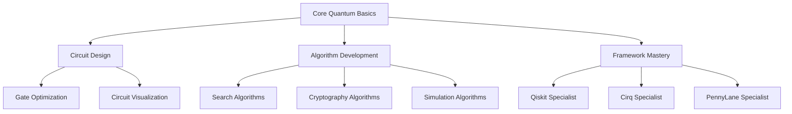

# QCanvas Gamification Plan

> **Last Updated:** January 23, 2026  
> **Version:** 1.0  
> **Status:** Planning Phase

## 📋 Executive Summary

This document outlines a comprehensive gamification strategy for QCanvas, a quantum computing learning platform. The plan aims to increase user engagement, motivation, and learning outcomes by integrating game mechanics into the quantum circuit simulation, conversion, and visualization experience.

### Key Objectives
- **Increase user engagement** by 40% within 6 months
- **Improve learning retention** through progressive challenges
- **Build an active community** of quantum computing learners
- **Encourage consistent practice** with daily/weekly goals
- **Provide clear skill progression** pathways

---

## 🎮 Gamification Strategies Overview

### 1. **Points & Experience System (XP)**
Reward users for completing learning activities and engaging with the platform.

### 2. **Levels & Skill Trees**
Progressive difficulty with clear learning pathways from beginner to advanced quantum concepts.

### 3. **Badges & Achievements**
Recognize milestones, special accomplishments, and mastery of specific topics.

### 4. **Leaderboards & Rankings**
Foster healthy competition and community engagement.

### 5. **Challenges & Quests**
Structured learning paths with specific goals and time constraints.

### 6. **Streaks & Daily Goals**
Encourage consistent engagement and habit formation.

### 7. **Social Features**
Enable collaboration, sharing, and peer learning.

### 8. **Rewards & Unlockables**
Provide tangible incentives for progression and achievement.

---

## 🎯 Core Gamification Mechanics

### 1. Experience Points (XP) System

#### XP Award Structure

| Activity | Base XP | Multipliers |
|----------|---------|-------------|
| **Circuit Creation & Simulation** | | |
| Create first circuit | 50 XP | First-time: 2x |
| Simulate circuit (1-2 qubits) | 10 XP | Complexity bonus: +5-20 XP |
| Simulate circuit (3-5 qubits) | 25 XP | Complexity bonus: +10-50 XP |
| Simulate circuit (6+ qubits) | 50 XP | Complexity bonus: +20-100 XP |
| Successful simulation (no errors) | +10 XP | Streak bonus: +5 XP per streak |
| **Circuit Conversion** | | |
| Convert between frameworks | 30 XP | First-time per pair: 2x |
| Qiskit ↔ Cirq | 30 XP | |
| Qiskit ↔ PennyLane | 30 XP | |
| Cirq ↔ PennyLane | 30 XP | |
| Complex conversion (10+ gates) | +20 XP | |
| **Learning Activities** | | |
| Complete tutorial | 100 XP | |
| Solve challenge problem | 150 XP | Difficulty multiplier: 1-3x |
| Implement algorithm (Grover, Shor, etc.) | 200 XP | |
| Create custom algorithm | 300 XP | |
| **Social & Collaboration** | | |
| Share circuit (first share) | 25 XP | |
| Get circuit upvoted | 5 XP | Per upvote (max 100 XP) |
| Comment on circuit | 5 XP | Quality bonus: +5-15 XP |
| Help another user | 50 XP | Verified help |
| **Daily & Consistency** | | |
| Daily login | 10 XP | Streak multiplier: +2 XP/day |
| Complete daily challenge | 75 XP | |
| Weekly challenge completion | 250 XP | |
| **Mastery & Exploration** | | |
| Master a concept (5 related circuits) | 100 XP | |
| Use all 3 frameworks | 150 XP | One-time |
| Explore advanced visualization | 30 XP | |

#### XP Calculation Formula

```
Total_XP = Base_XP × Complexity_Multiplier × First_Time_Bonus × Streak_Bonus
```

- **Complexity_Multiplier**: 1 + (num_gates / 10) + (num_qubits × 0.2)
- **First_Time_Bonus**: 2x for first completion of activity type
- **Streak_Bonus**: 1 + (streak_days × 0.1) (max 2x)

---

### 2. Level & Progression System

#### Level Tiers

| Level Range | Title | XP Required (Cumulative) | Focus Area |
|-------------|-------|--------------------------|------------|
| **1-5** | **Quantum Novice** | 0-1,000 XP | Basic gates, single qubits, simple circuits |
| **6-10** | **Circuit Builder** | 1,000-3,000 XP | Multi-qubit circuits, basic algorithms |
| **11-20** | **Quantum Explorer** | 3,000-8,000 XP | Framework conversions, optimizations |
| **21-30** | **Algorithm Designer** | 8,000-20,000 XP | Classic algorithms (Deutsch-Jozsa, Grover) |
| **31-40** | **Quantum Engineer** | 20,000-40,000 XP | Complex algorithms, error mitigation |
| **41-50** | **Quantum Master** | 40,000-75,000 XP | Research-level circuits, novel algorithms |
| **51+** | **Quantum Guru** | 75,000+ XP | Community leadership, advanced research |

#### Level-Up Rewards

Each level-up grants:
- **Unlock new content** (advanced tutorials, algorithms, challenges)
- **Profile customization** (badges, titles, themes)
- **Increased visibility** (featured on leaderboards)
- **Special privileges** (early access to beta features)

#### Skill Trees

Users can specialize in different quantum computing areas:



Each node in the skill tree requires:
- **Prerequisites** (previous nodes completed)
- **Specific achievements** (e.g., "Create 10 circuits with Grover's algorithm")
- **XP threshold**

---

### 3. Badges & Achievements System

#### Badge Categories

##### 🌟 **Getting Started Badges**
| Badge | Criteria | Reward |
|-------|----------|--------|
| First Steps | Create your first circuit | 50 XP, Profile icon |
| Hello Quantum | Simulate your first Bell state | 75 XP |
| Framework Explorer | Try all 3 frameworks | 150 XP, Special title |
| Gate Master | Use all basic gates (H, X, CNOT, etc.) | 100 XP |

##### 🔬 **Algorithm Badges**
| Badge | Criteria | Reward |
|-------|----------|--------|
| Entanglement Expert | Create 10 entangled circuits | 200 XP |
| Superposition Savant | Use superposition in 20 circuits | 150 XP |
| Deutsch Detective | Implement Deutsch-Jozsa algorithm | 300 XP |
| Grover's Guardian | Implement Grover's search | 400 XP |
| Shor's Scholar | Implement Shor's factoring | 500 XP |
| VQE Virtuoso | Implement VQE algorithm | 400 XP |
| QAOA Champion | Implement QAOA | 450 XP |

##### 🏆 **Mastery Badges**
| Badge | Criteria | Reward |
|-------|----------|--------|
| Qubit Wrangler | Simulate 100 circuits | 300 XP |
| Conversion King/Queen | Convert 50 circuits | 250 XP |
| Speed Demon | Complete 10 circuits in under 5 minutes | 200 XP, Speed title |
| Perfectionist | Create 25 error-free circuits | 350 XP |
| Optimizer | Reduce circuit depth by 50% in 10 circuits | 400 XP |

##### 📚 **Learning Badges**
| Badge | Criteria | Reward |
|-------|----------|--------|
| Tutorial Completionist | Complete all tutorials | 500 XP |
| Quiz Master | Score 90%+ on 10 quizzes | 300 XP |
| Challenge Accepted | Complete 20 challenges | 400 XP |
| Concept Master | Master 5 quantum concepts | 350 XP |

##### 🔥 **Streak Badges**
| Badge | Criteria | Reward |
|-------|----------|--------|
| 7-Day Streak | Practice 7 days in a row | 150 XP, Streak icon |
| 30-Day Streak | Practice 30 days in a row | 500 XP, Dedicated title |
| 100-Day Streak | Practice 100 days in a row | 1,500 XP, Legend title |
| Weekend Warrior | Complete 10 weekend challenges | 300 XP |

##### 👥 **Social Badges**
| Badge | Criteria | Reward |
|-------|----------|--------|
| Collaborator | Share 10 circuits | 150 XP |
| Community Helper | Help 10 users | 300 XP |
| Upvote Champion | Receive 100 upvotes | 400 XP |
| Mentor | Help 5 beginners complete first circuit | 500 XP, Mentor title |

##### 🎓 **Specialization Badges**
| Badge | Criteria | Reward |
|-------|----------|--------|
| Qiskit Specialist | Complete 50 Qiskit circuits | 300 XP, Framework badge |
| Cirq Expert | Complete 50 Cirq circuits | 300 XP, Framework badge |
| PennyLane Pro | Complete 50 PennyLane circuits | 300 XP, Framework badge |
| Multi-Framework Master | Expert in all 3 frameworks | 1,000 XP, Rare title |

##### 🌈 **Secret/Hidden Badges**
| Badge | Criteria | Reward |
|-------|----------|--------|
| Easter Egg Hunter | Find hidden feature | 250 XP |
| Night Owl | Complete 10 circuits after midnight | 200 XP |
| Early Bird | Complete 10 circuits before 6 AM | 200 XP |
| Lucky Number | Create circuit with exactly 42 gates | 150 XP |

#### Badge Rarity System

- **Common** (Bronze): Easy to obtain, participation-based
- **Uncommon** (Silver): Requires consistent effort
- **Rare** (Gold): Significant accomplishment
- **Epic** (Purple): Exceptional achievement
- **Legendary** (Rainbow): Extremely rare, top-tier mastery

---

### 4. Leaderboards & Rankings

#### Leaderboard Types

##### 📊 **Global Leaderboards**
- **All-Time XP**: Total XP earned
- **Monthly XP**: XP earned this month (resets monthly)
- **Weekly XP**: XP earned this week (resets weekly)
- **Circuit Count**: Total circuits created
- **Conversion Count**: Total conversions completed

##### 🎯 **Category Leaderboards**
- **Algorithm Mastery**: Most algorithms implemented
- **Framework Expert**: Most proficient in specific framework
- **Speed Challenges**: Fastest completion times
- **Optimization Leader**: Best circuit optimizations

##### 👥 **Social Leaderboards**
- **Most Helpful**: Users who help others most
- **Most Popular**: Most upvoted circuits
- **Top Collaborator**: Most shared and collaborative work

#### Ranking System

| Rank Tier | Requirements | Visual Indicator |
|-----------|--------------|------------------|
| **Bronze** | Top 50% | Bronze medal icon |
| **Silver** | Top 25% | Silver medal icon |
| **Gold** | Top 10% | Gold medal icon |
| **Platinum** | Top 5% | Platinum medal icon |
| **Diamond** | Top 1% | Diamond medal icon |

#### Anti-Gaming Measures
- **Activity throttling**: Max XP per day from repetitive actions
- **Diversity bonuses**: Encourage variety in activities
- **Quality over quantity**: Manual review for suspicious activity
- **Fair play detection**: Automated detection of cheating patterns

---

### 5. Challenges & Quests System

#### Daily Challenges

Users get 3 daily challenges (refreshes every 24 hours):

##### Easy Challenge (50-75 XP)
- Create a circuit with 2 qubits
- Use 3 different gates
- Simulate any circuit
- Convert a circuit to OpenQASM

##### Medium Challenge (100-150 XP)
- Create a Bell state circuit
- Use entanglement in a circuit
- Convert between 2 different frameworks
- Optimize a circuit to reduce depth by 20%

##### Hard Challenge (200-300 XP)
- Implement a specific algorithm (Deutsch-Jozsa, etc.)
- Create a 5-qubit circuit with specific properties
- Achieve 95%+ accuracy in simulation
- Complete a time-limited challenge

#### Weekly Quests

Multi-step challenges that span a week:

##### **Week 1: "Quantum Fundamentals"**
1. Create 5 single-qubit circuits (50 XP)
2. Create 3 two-qubit entangled circuits (100 XP)
3. Use all basic gates (X, H, Z, CNOT) (100 XP)
4. **Bonus**: Complete all without errors (150 XP)
- **Total Reward**: 400 XP + "Fundamentals Champion" badge

##### **Week 2: "Framework Explorer"**
1. Create a circuit in Qiskit (50 XP)
2. Create a circuit in Cirq (50 XP)
3. Create a circuit in PennyLane (50 XP)
4. Convert between all framework pairs (150 XP)
- **Total Reward**: 300 XP + "Framework Explorer" badge

##### **Week 3: "Algorithm Adventure"**
1. Implement Deutsch algorithm (150 XP)
2. Implement Grover's algorithm (200 XP)
3. Run both with different parameters (100 XP)
- **Total Reward**: 450 XP + "Algorithm Adventurer" badge

#### Monthly Challenges

Large-scale challenges with significant rewards:

##### **"Quantum Master Challenge"**
- Implement 5 different quantum algorithms
- Use all 3 frameworks
- Optimize at least 2 algorithms
- Share and get 10 upvotes
- **Reward**: 2,000 XP + "Monthly Champion" title + Feature on homepage

#### Challenge Difficulty Scaling

Challenges adapt to user level:
- **Levels 1-10**: Focus on basics (gates, simple circuits)
- **Levels 11-20**: Framework conversions, optimization
- **Levels 21-30**: Algorithm implementation
- **Levels 31+**: Advanced challenges, research-level problems

---

### 6. Streaks & Consistency Features

#### Daily Streak System

Track consecutive days of activity:

| Streak Milestone | Reward | Visual |
|------------------|--------|--------|
| 3 days | 50 XP | 🔥 |
| 7 days | 150 XP + Badge | 🔥🔥 |
| 14 days | 300 XP | 🔥🔥🔥 |
| 30 days | 750 XP + Title | 🔥🔥🔥🔥 |
| 50 days | 1,500 XP | 🔥🔥🔥🔥🔥 |
| 100 days | 3,000 XP + Legendary Badge | 💎 |

#### Streak Protection
- **1 Freeze Token** earned every 7-day streak
- Use freeze to protect streak if you miss a day
- Max 3 freeze tokens stored

#### Activity Goals

Daily/Weekly goals to maintain engagement:

##### **Daily Goals** (75 XP bonus for all 3)
- [ ] Complete 1 simulation
- [ ] Learn something new (tutorial/quiz)
- [ ] Engage with community (comment/share)

##### **Weekly Goals** (250 XP bonus for all)
- [ ] Complete 5 different circuits
- [ ] Try 2 different frameworks
- [ ] Master 1 new concept
- [ ] Help 1 other user

---

### 7. Social & Community Features

#### Circuit Sharing & Collaboration

##### **Public Circuit Gallery**
- Share circuits with description and tags
- Others can clone, modify, and build upon
- Upvote/downvote system
- Comments and discussions

##### **Collaboration Tools**
- **Co-creation**: Multiple users work on same circuit
- **Circuit challenges**: Create challenge for others to solve
- **Solutions sharing**: Share different approaches to same problem

##### **Social Stats**
Track social engagement:
- **Circuits shared**: Total public circuits
- **Total upvotes**: Community appreciation
- **Helpfulness score**: Based on comments and assistance
- **Collaborations**: Joint projects completed

#### Community Events

##### **Global Challenges**
Monthly/quarterly community-wide events:
- **"Quantum Olympics"**: Timed challenges for all skill levels
- **"Innovation Week"**: Create novel algorithms or approaches
- **"Teaching Tuesday"**: Help beginners, earn mentor XP

##### **Team Competitions**
- Form teams (3-5 users)
- Compete in team challenges
- Team leaderboards
- Shared rewards

#### Mentorship Program

##### **Become a Mentor** (Level 30+)
- Earn mentor badge
- Get matched with beginners
- Bonus XP for each mentee milestone
- Special mentor-only challenges

##### **Find a Mentor** (Levels 1-20)
- Request mentor assistance
- Get personalized guidance
- Unlock "Mentored" badge when graduating

---

### 8. Rewards & Unlockables

#### Profile Customization

##### **Unlockable Themes**
- **Light/Dark mode variants**: Earned at Level 5
- **Quantum-themed colors**: Unlock with badges
- **Custom avatars**: Earned through achievements
- **Profile frames**: Special events and milestones

##### **Titles & Badges Display**
- Display up to 3 favorite badges
- Custom title selection
- Animated badge effects for legendary badges

#### Feature Unlocks

| Level | Unlocked Feature |
|-------|------------------|
| 1 | Basic circuit creation |
| 3 | Circuit saving and history |
| 5 | Framework conversion (1 pair) |
| 7 | Advanced visualization tools |
| 10 | All framework conversions |
| 15 | Circuit optimization suggestions |
| 20 | Advanced simulation backends |
| 25 | Custom algorithm templates |
| 30 | Mentor mode |
| 40 | Beta feature access |
| 50 | Custom challenge creation |

#### Virtual Currency: **Quantum Coins (QC)**

Earn coins through achievements, not purchasable with real money:

##### **Earning QC**
- Level up: 10 QC
- Complete monthly challenge: 50 QC
- Win leaderboard (top 10): 100 QC
- Special events: 25-200 QC

##### **Spending QC**
- Cosmetic profile items: 25-100 QC
- Streak freeze tokens: 50 QC
- Reveal hidden challenges: 30 QC
- Custom circuit templates: 75 QC
- Priority support: 200 QC

---

## 📈 Implementation Phases

### Phase 1: Foundation (Months 1-2)
**Goal: Basic gamification infrastructure**

#### Database Schema
- `user_gamification` table (user_id, total_xp, level, current_streak, etc.)
- `achievements` table (id, name, description, criteria_json, reward_xp, rarity)
- `user_achievements` table (user_id, achievement_id, earned_at, progress_json)
- `leaderboards` table (ranking snapshots)
- `activities` table (activity logging for XP calculation)
- `challenges` table (daily/weekly/monthly challenges)
- `user_challenges` table (user progress on challenges)

#### Core Features
- XP tracking system
- Level calculation and display
- Basic achievement detection
- Simple leaderboard (all-time XP)
- Activity logging

#### API Endpoints
```
POST /api/gamification/activity        # Log activity and award XP
GET  /api/gamification/stats/:user_id  # Get user gamification stats
GET  /api/gamification/achievements    # Get all achievements
GET  /api/gamification/leaderboard     # Get leaderboard data
```

#### Frontend Components
- XP progress bar (header/navbar)
- Level display badge
- Achievement notification toasts
- Basic profile gamification page

#### Success Metrics
- [ ] All users see XP gains after actions
- [ ] Level-up notifications working
- [ ] At least 20 achievements defined
- [ ] Leaderboard updating in real-time

---

### Phase 2: Engagement (Months 3-4)
**Goal: Daily/weekly challenges and streaks**

#### New Features
- Daily challenge system (3 challenges/day)
- Weekly quests (multi-step challenges)
- Streak tracking and protection
- Challenge recommendation engine
- Daily/weekly goal system

#### Database Additions
- `daily_challenges` table
- `weekly_quests` table
- `streak_history` table
- `freeze_tokens` table

#### API Endpoints
```
GET  /api/gamification/challenges/daily     # Get today's challenges
GET  /api/gamification/challenges/weekly    # Get current week's quest
POST /api/gamification/challenges/complete  # Mark challenge as complete
GET  /api/gamification/streak               # Get streak info
POST /api/gamification/streak/freeze        # Use freeze token
```

#### Frontend Components
- Daily challenge modal (on login)
- Weekly quest progress tracker
- Streak indicator with fire emoji
- Freeze token UI

#### Success Metrics
- [ ] 60% of users engage with daily challenges
- [ ] Average streak length > 5 days
- [ ] 30% weekly quest completion rate

---

### Phase 3: Social (Months 5-6)
**Goal: Community features and collaboration**

#### New Features
- Public circuit gallery
- Circuit sharing and cloning
- Upvote/downvote system
- Comments and discussions
- User following system
- Mentorship matching

#### Database Additions
- `shared_circuits` table
- `circuit_votes` table
- `circuit_comments` table
- `user_follows` table
- `mentorship_pairs` table

#### API Endpoints
```
POST /api/circuits/share                # Share a circuit publicly
GET  /api/circuits/public               # Browse shared circuits
POST /api/circuits/:id/vote             # Upvote/downvote circuit
POST /api/circuits/:id/comment          # Comment on circuit
POST /api/social/follow/:user_id        # Follow a user
GET  /api/social/feed                   # Get activity feed
POST /api/mentorship/request            # Request mentor
```

#### Frontend Components
- Public circuit gallery page
- Circuit detail page with comments
- Social profile page
- Activity feed
- Mentorship dashboard

#### Success Metrics
- [ ] 40% of users share at least 1 circuit
- [ ] Average 5+ upvotes per shared circuit
- [ ] 50+ active mentor-mentee pairs

---

### Phase 4: Advanced (Months 7-8)
**Goal: Skill trees, team competitions, and events**

#### New Features
- Skill tree system with specializations
- Team formation and competitions
- Monthly global events
- Custom challenge creation (high-level users)
- Advanced analytics and insights

#### Database Additions
- `skill_trees` table
- `user_skills` table
- `teams` table
- `team_members` table
- `team_challenges` table
- `global_events` table

#### API Endpoints
```
GET  /api/gamification/skill-tree           # Get skill tree structure
POST /api/gamification/skill-tree/unlock    # Unlock skill node
POST /api/teams/create                      # Create team
POST /api/teams/:id/join                    # Join team
GET  /api/events/current                    # Get current global event
POST /api/challenges/create                 # Create custom challenge
```

#### Frontend Components
- Interactive skill tree visualization
- Team management page
- Global event page with live updates
- Challenge creator tool
- Advanced analytics dashboard

#### Success Metrics
- [ ] 25% of users engage with skill trees
- [ ] 100+ active teams
- [ ] 1,000+ participants in monthly event

---

### Phase 5: Polish & Scale (Months 9-12)
**Goal: Optimization, advanced features, and community growth**

#### Focus Areas
- Performance optimization (caching, indexing)
- Advanced anti-cheat measures
- AI-powered challenge recommendations
- Mobile app gamification sync
- Advanced reporting and analytics
- Community moderation tools

#### Success Metrics
- [ ] Page load time < 2 seconds
- [ ] 5,000+ monthly active users
- [ ] 80% user retention month-over-month
- [ ] 10,000+ circuits shared

---

## 🎨 UI/UX Design Guidelines

### Visual Design Principles

#### **1. Immediate Feedback**
- XP gain animations (+50 XP popup)
- Progress bar smoothly fills up
- Achievement unlock modal with celebration
- Level-up fanfare with confetti

#### **2. Clear Progress Indicators**
```
Current Progress: [████████░░░░░░░░] Level 12 → 13
                  2,450 / 3,000 XP
```

#### **3. Achievement Showcase**
Display badges with:
- Rarity-colored borders (Bronze, Silver, Gold, etc.)
- Unlock date
- Progress toward next badge in category
- "Locked" state showing how to unlock

#### **4. Gamification Dashboard**
Centralized page showing:
- Current level and XP
- Active challenges (daily/weekly/monthly)
- Current streak
- Recent achievements
- Leaderboard position
- Skill tree progress

### Color Scheme

| Element | Color | Usage |
|---------|-------|-------|
| XP Gain | #10B981 (Green) | Positive feedback |
| Level Up | #F59E0B (Gold) | Celebration |
| Streak | #EF4444 (Red/Orange) | Fire emoji theme |
| Achievements | #8B5CF6 (Purple) | Special rewards |
| Common Badges | #A8A29E (Bronze) | Entry-level |
| Rare Badges | #FBBF24 (Gold) | Mastery |
| Legendary | #EC4899 (Pink/Rainbow) | Ultimate achievements |

### Notification Strategy

| Priority | Notification Type | Example |
|----------|-------------------|---------|
| **High** | Modal popup | Level up, major achievement |
| **Medium** | Toast notification | XP gained, challenge completed |
| **Low** | Badge indicator | New challenge available |

---

## 📊 Analytics & Metrics

### Key Performance Indicators (KPIs)

#### Engagement Metrics
- **Daily Active Users (DAU)**: Target 1,000+ by month 6
- **Weekly Active Users (WAU)**: Target 3,000+ by month 6
- **Average session duration**: Target 15+ minutes
- **Actions per session**: Target 10+ activities

#### Gamification-Specific Metrics
- **XP distribution**: Track average XP by user cohort
- **Achievement unlock rate**: Target 5+ achievements per user
- **Challenge completion rate**: Target 60% for daily challenges
- **Streak retention**: Target 30% of users with 7+ day streak
- **Leaderboard engagement**: Target 40% of users checking leaderboard weekly

#### Learning Metrics
- **Concept mastery**: Track progression through skill trees
- **Algorithm implementation rate**: Users implementing advanced algorithms
- **Framework diversity**: Users trying multiple frameworks
- **Repeat visits**: Returning user rate

#### Social Metrics
- **Circuit sharing rate**: Target 40% of users share circuits
- **Upvote engagement**: Average upvotes per shared circuit
- **Comment activity**: Comments per shared circuit
- **Mentorship pairing success**: Successful mentor-mentee matches

### A/B Testing Opportunities

#### Test 1: XP Reward Amounts
- **Variant A**: Current XP values
- **Variant B**: 2x XP for first week
- **Metric**: User retention at day 7

#### Test 2: Challenge Difficulty
- **Variant A**: 3 random difficulty challenges
- **Variant B**: 1 easy, 1 medium, 1 hard
- **Metric**: Challenge completion rate

#### Test 3: Notification Frequency
- **Variant A**: Notify on every achievement
- **Variant B**: Batch notifications (1 per session)
- **Metric**: User annoyance vs engagement

---

## 🔒 Anti-Gaming & Fair Play

### Abuse Prevention

#### Rate Limiting
- Max XP per activity type per day (e.g., max 500 XP from simulations)
- Cooldown on repeated identical actions
- Diversity bonus to encourage varied activities

#### Quality Filters
- Minimum circuit complexity for XP (e.g., at least 2 gates)
- Simulation must run successfully
- Anti-spam for social actions (comments, shares)

#### Detection Algorithms
- Anomaly detection for unusual XP spikes
- Pattern recognition for bot-like behavior
- Manual review queue for suspicious activity

#### Penalties
- **Warning**: First offense, reset suspicious XP gains
- **Suspension**: Repeat offenses, freeze gamification for 7 days
- **Ban**: Severe violations, permanent gamification ban

---

## 🚀 Launch Strategy

### Pre-Launch (Month 1)

#### Internal Testing
- Beta test with 50 users from existing user base
- Collect feedback on XP balance, achievement difficulty
- Iterate on UI/UX based on feedback

#### Content Preparation
- Create all tutorial content aligned with gamification
- Design 100+ achievements across all categories
- Prepare challenge database (daily/weekly/monthly)

### Soft Launch (Month 2)

#### Gradual Rollout
- Enable for 10% of users
- Monitor server load and performance
- Collect usage data and adjust XP values

#### Marketing Teaser
- Announce gamification coming soon
- Showcase badges and achievements
- Create excitement with leaderboard preview

### Full Launch (Month 3)

#### Launch Day Activities
- Enable for all users
- Launch event: "Quantum Grand Prix" (special challenges)
- Email campaign announcing gamification
- Social media push with user testimonials

#### Post-Launch (Months 3-6)
- Weekly content updates (new challenges)
- Monthly themed events
- Community spotlight (featured users)
- Iterative improvements based on analytics

---

## 🎓 Educational Alignment

### Learning Outcomes Integration

Gamification should reinforce learning, not distract from it:

#### Principle 1: **Challenges Mirror Real Quantum Problems**
- Algorithm challenges based on actual quantum use cases
- Circuit optimization reflects real hardware constraints
- Framework conversions teach practical interoperability

#### Principle 2: **Progressive Difficulty**
- Skill tree ensures prerequisites before advanced topics
- Challenges adapt to user skill level
- Tutorials unlock sequentially

#### Principle 3: **Concept Reinforcement**
- Multiple achievements per quantum concept
- Repetition with variation (different circuits, same concept)
- Retrieval practice through quiz challenges

#### Principle 4: **Community Learning**
- Peer review of shared circuits
- Mentorship for knowledge transfer
- Collaborative challenges encourage discussion

### Pedagogical Best Practices

#### Spaced Repetition
- Daily challenges revisit concepts
- Weekly quests reinforce weekly learning
- Monthly challenges test comprehensive understanding

#### Immediate Feedback
- XP gain confirms correct actions
- Achievement unlock validates mastery
- Error messages guide improvement

#### Intrinsic Motivation
- Badges for curiosity and exploration
- Skill trees allow personalized learning paths
- Community recognition for helping others

---

## 🛠️ Technical Architecture

### Backend Services

```
gamification_service/
├── xp_calculator.py          # Calculate XP for activities
├── achievement_detector.py   # Check achievement criteria
├── leaderboard_manager.py    # Update and query leaderboards
├── challenge_generator.py    # Generate daily/weekly challenges
├── streak_tracker.py         # Track and update streaks
└── anti_cheat.py             # Detect and prevent abuse
```

### Database Schema (PostgreSQL)

#### Core Tables

```sql
-- User gamification stats
CREATE TABLE user_gamification (
    user_id UUID PRIMARY KEY REFERENCES users(id),
    total_xp INTEGER DEFAULT 0,
    level INTEGER DEFAULT 1,
    current_streak INTEGER DEFAULT 0,
    longest_streak INTEGER DEFAULT 0,
    last_activity_date DATE,
    freeze_tokens INTEGER DEFAULT 0,
    quantum_coins INTEGER DEFAULT 0,
    created_at TIMESTAMP DEFAULT NOW(),
    updated_at TIMESTAMP DEFAULT NOW()
);

-- Achievements catalog
CREATE TABLE achievements (
    id UUID PRIMARY KEY,
    name VARCHAR(255) NOT NULL,
    description TEXT,
    category VARCHAR(50),  -- 'getting_started', 'algorithm', 'mastery', etc.
    criteria_json JSON NOT NULL,  -- Conditions to unlock
    reward_xp INTEGER,
    reward_coins INTEGER,
    rarity VARCHAR(20),  -- 'common', 'uncommon', 'rare', 'epic', 'legendary'
    icon_url VARCHAR(255),
    is_hidden BOOLEAN DEFAULT FALSE,
    created_at TIMESTAMP DEFAULT NOW()
);

-- User achievements (unlocked)
CREATE TABLE user_achievements (
    id UUID PRIMARY KEY,
    user_id UUID REFERENCES users(id),
    achievement_id UUID REFERENCES achievements(id),
    progress_json JSON,  -- Track multi-step progress
    earned_at TIMESTAMP,
    created_at TIMESTAMP DEFAULT NOW(),
    UNIQUE(user_id, achievement_id)
);

-- Activity log (for XP calculation and analytics)
CREATE TABLE activities (
    id UUID PRIMARY KEY,
    user_id UUID REFERENCES users(id),
    activity_type VARCHAR(50),  -- 'simulation', 'conversion', 'share', etc.
    xp_awarded INTEGER,
    metadata_json JSON,  -- Additional context
    created_at TIMESTAMP DEFAULT NOW()
);

-- Leaderboards (snapshots)
CREATE TABLE leaderboards (
    id UUID PRIMARY KEY,
    period VARCHAR(20),  -- 'all_time', 'monthly', 'weekly'
    period_start DATE,
    period_end DATE,
    rankings_json JSON,  -- Ordered list of {user_id, xp, rank}
    created_at TIMESTAMP DEFAULT NOW()
);

-- Challenges
CREATE TABLE challenges (
    id UUID PRIMARY KEY,
    type VARCHAR(20),  -- 'daily', 'weekly', 'monthly'
    title VARCHAR(255),
    description TEXT,
    difficulty VARCHAR(20),  -- 'easy', 'medium', 'hard'
    criteria_json JSON,
    reward_xp INTEGER,
    reward_coins INTEGER,
    active_date DATE,
    expires_at TIMESTAMP,
    created_at TIMESTAMP DEFAULT NOW()
);

-- User challenge progress
CREATE TABLE user_challenges (
    id UUID PRIMARY KEY,
    user_id UUID REFERENCES users(id),
    challenge_id UUID REFERENCES challenges(id),
    progress_json JSON,
    completed_at TIMESTAMP,
    created_at TIMESTAMP DEFAULT NOW(),
    UNIQUE(user_id, challenge_id)
);

-- Skill trees
CREATE TABLE skill_trees (
    id UUID PRIMARY KEY,
    name VARCHAR(255),
    tree_structure_json JSON,  -- Nodes, prerequisites, rewards
    created_at TIMESTAMP DEFAULT NOW()
);

-- User skill progress
CREATE TABLE user_skills (
    id UUID PRIMARY KEY,
    user_id UUID REFERENCES users(id),
    skill_tree_id UUID REFERENCES skill_trees(id),
    unlocked_nodes_json JSON,  -- List of unlocked node IDs
    created_at TIMESTAMP DEFAULT NOW(),
    updated_at TIMESTAMP DEFAULT NOW()
);
```

### API Design

#### RESTful Endpoints

```typescript
// XP and levels
POST   /api/gamification/activity
GET    /api/gamification/stats/:user_id
GET    /api/gamification/level-info/:level

// Achievements
GET    /api/gamification/achievements
GET    /api/gamification/achievements/:user_id
POST   /api/gamification/achievements/check  // Check if criteria met

// Leaderboards
GET    /api/gamification/leaderboard
GET    /api/gamification/leaderboard/:period  // all_time, monthly, weekly
GET    /api/gamification/rank/:user_id

// Challenges
GET    /api/gamification/challenges/daily
GET    /api/gamification/challenges/weekly
GET    /api/gamification/challenges/monthly
POST   /api/gamification/challenges/:id/complete
GET    /api/gamification/challenges/:id/progress

// Streaks
GET    /api/gamification/streak/:user_id
POST   /api/gamification/streak/freeze

// Skill trees
GET    /api/gamification/skill-tree
POST   /api/gamification/skill-tree/unlock
GET    /api/gamification/skill-tree/progress/:user_id

// Social
POST   /api/circuits/share
GET    /api/circuits/public
POST   /api/circuits/:id/vote
POST   /api/circuits/:id/comment
```

### Caching Strategy

Use Redis for:
- **Leaderboard rankings**: Update every 5 minutes
- **Daily challenge cache**: Cache for 24 hours
- **User stats**: Cache for 1 minute, invalidate on activity
- **Achievement catalog**: Cache for 1 hour

### Real-Time Updates

Use WebSockets for:
- XP gain notifications
- Level-up celebrations
- Achievement unlocks
- Leaderboard position updates
- Challenge completion alerts

---

## 📱 Mobile & Cross-Platform

### Mobile App Considerations

#### Notifications
- Push notifications for:
  - Daily challenge available
  - Streak in danger (no activity in 20 hours)
  - Level up
  - New achievement unlocked
  - Leaderboard position change (top 10)

#### Offline Mode
- Cache challenges for offline work
- Queue XP gains for sync when online
- Local streak tracking with cloud sync

#### Mobile-Specific Features
- Quick challenge via widget
- Streak widget on home screen
- Achievement showcase on lock screen

---

## 🌍 Internationalization & Accessibility

### Localization
- Translate all achievement names and descriptions
- Localized leaderboards (by region/country)
- Cultural considerations for badge imagery

### Accessibility
- Screen reader support for achievements
- Colorblind-friendly badge colors
- Keyboard navigation for gamification UI
- Alt text for all badge/achievement icons

---

## 💡 Future Enhancements (Post-Launch)

### Year 2 Features

#### AI-Powered Personalization
- Adaptive challenge difficulty based on performance
- Personalized learning path recommendations
- Smart mentor matching based on expertise

#### Advanced Social Features
- Guilds/Clans for team competitions
- Circuit marketplace (share premium circuits for QC)
- Live coding challenges (synchronous competitions)

#### Integration with External Platforms
- GitHub integration (import quantum repos, earn badges)
- Research paper citations (earn academic badges)
- Conference participation badges

#### Gamified Tutorials
- Interactive storyline tutorials
- Choose-your-own-adventure quantum learning
- Boss battles (complex algorithm challenges)

---

## 📚 Resources & References

### Gamification Best Practices
- *Actionable Gamification* by Yu-kai Chou
- *The Gamification of Learning*  by Karl Kapp
- Duolingo's gamification case study
- Khan Academy's badge system

### Quantum Computing Education
- IBM Quantum Learning Platform
- Qiskit Textbook gamification elements
- Google Quantum AI educational resources

### Technical References
- Redis leaderboard patterns
- PostgreSQL JSONB indexing for achievement criteria
- WebSocket real-time notifications best practices

---

## 🎯 Summary & Next Steps

### Key Takeaways

1. **Comprehensive System**: Multi-layered gamification with XP, levels, badges, challenges, streaks, and social features
2. **Learning-Focused**: Every mechanic reinforces quantum computing education
3. **Phased Rollout**: 5 phases over 12 months for sustainable growth
4. **Community-Driven**: Social features and mentorship for collaborative learning
5. **Data-Driven**: Analytics and A/B testing to optimize engagement

### Immediate Next Steps

#### For Users
No action required—gamification will be rolled out progressively.

#### For Developers
1. **Read this plan thoroughly** and ask questions
2. **Review database schema** and suggest improvements
3. **Prototype Phase 1 features** (XP, levels, basic achievements)
4. **Set up analytics tracking** for baseline metrics
5. **Create initial achievement catalog** (50+ achievements)

#### For Designers
1. **Design badge artwork** for common/uncommon/rare badges
2. **Create UI mockups** for gamification dashboard
3. **Design XP gain animations** and level-up celebrations
4. **Develop color scheme** based on rarity tiers

#### For Product Managers
1. **Prioritize Phase 1 features** for development sprint
2. **Coordinate with marketing** for launch campaign
3. **Set up beta testing group** (50 users)
4. **Define success criteria** for each phase

---

## 📝 Changelog

| Version | Date | Changes |
|---------|------|---------|
| 1.0 | Jan 23, 2026 | Initial gamification plan created |

---

**Document Owner**: QCanvas Team  
**Last Reviewed**: January 23, 2026  
**Next Review**: February 23, 2026

**Questions or Feedback?** Contact the QCanvas team or submit issues via GitHub.

---

*This gamification plan is a living document and will be updated as we learn from user feedback and analytics.*
